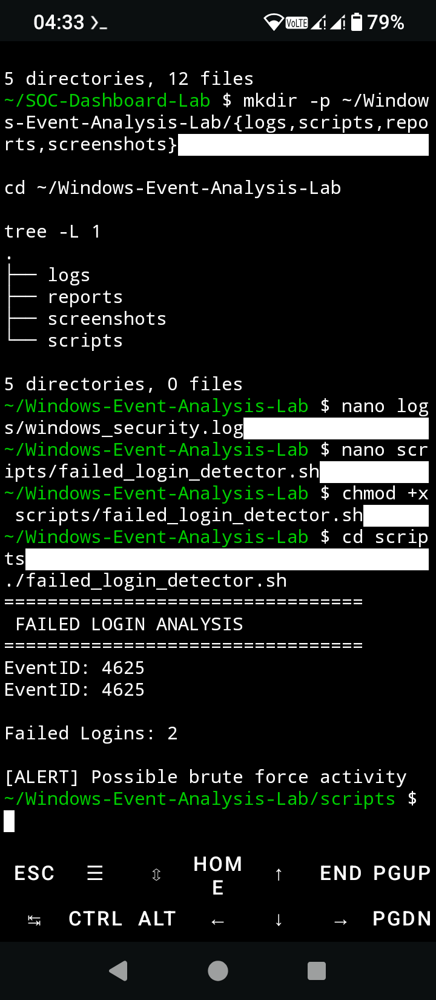
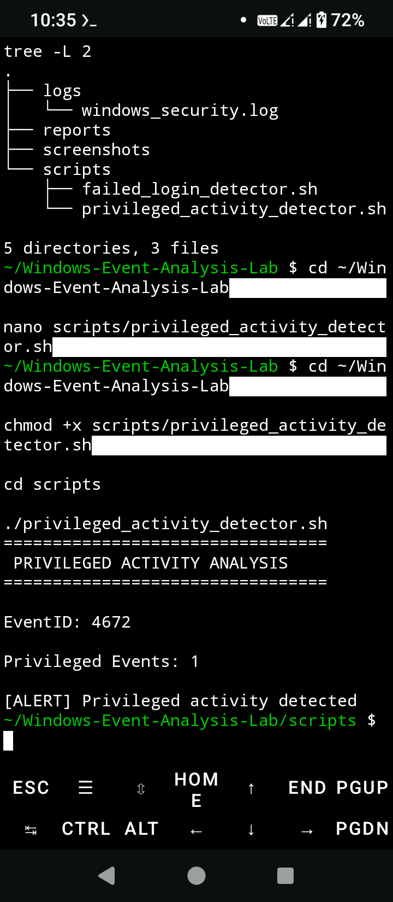
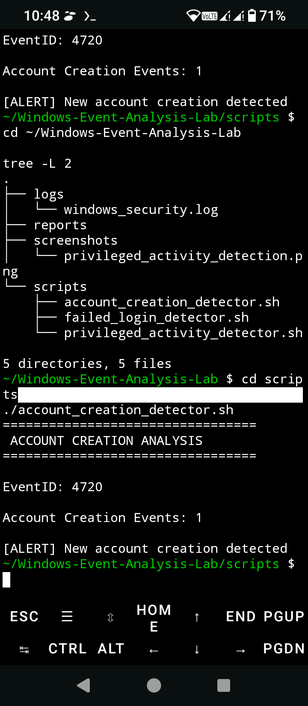
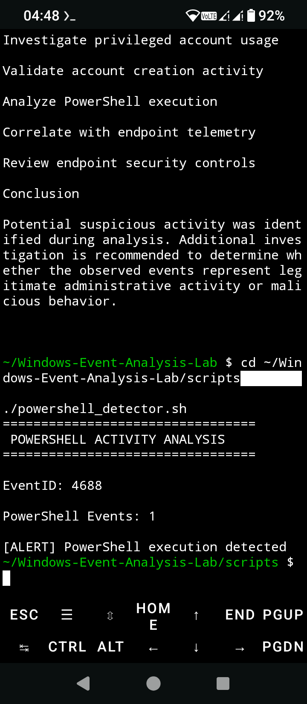

# Windows Event Analysis Lab

A cybersecurity project demonstrating Windows Security Event Log analysis, incident investigation, detection engineering, and MITRE ATT&CK mapping.

---

## Overview

This project demonstrates how Security Operations Center (SOC) analysts investigate Windows Security Event Logs to identify suspicious authentication attempts, privileged account activity, unauthorized account creation, and PowerShell execution.

The lab uses Bash automation to parse Windows Security Event Logs, detect security events, and document findings through professional investigation reports.

---

## Objectives

- Demonstrate Windows Security Event Log analysis.
- Detect common security events using Bash scripts.
- Investigate authentication and privilege-related activity.
- Map detections to the MITRE ATT&CK framework.
- Produce SOC investigation documentation.
- Demonstrate skills expected of an entry-level SOC Analyst.

---

## Features

### Failed Login Analysis

- Detects Windows Event ID **4625**
- Identifies repeated failed authentication attempts
- Supports brute-force detection scenarios

### Privileged Activity Analysis

- Detects Windows Event ID **4672**
- Identifies privileged account activity
- Highlights possible privilege escalation

### Account Creation Analysis

- Detects Windows Event ID **4720**
- Identifies newly created user accounts
- Supports persistence detection

### PowerShell Activity Analysis

- Detects Windows Event ID **4688**
- Identifies PowerShell execution
- Supports execution technique detection

---

## MITRE ATT&CK Coverage

| Event ID | Technique | Description |
|----------|-----------|-------------|
|4625|T1110|Brute Force|
|4672|T1078|Valid Accounts|
|4720|T1136|Create Account|
|4688|T1059.001|PowerShell|

---

## Detection Coverage

| Detection | Event ID | Severity |
|-----------|----------|----------|
|Failed Login Attempts|4625|High|
|Privileged Activity|4672|High|
|Account Creation|4720|Medium|
|PowerShell Execution|4688|High|

---

## Detection Coverage

- Bash
- Linux
- Termux
- Git
- GitHub
- Windows Security Event Logs
- MITRE ATT&CK

---

## Project Structure

```text
Windows-Event-Analysis-Lab
├── logs
│   └── windows_security.log
├── reports
│   ├── executive_summary.md
│   ├── mitre_mapping.md
│   └── windows_event_analysis_report.txt
├── screenshots
│   ├── account_creation_detection.png
│   ├── failed_login_analysis.png
│   ├── powershell_detections.png
│   └── privileged_activity_detection.png
├── scripts
│   ├── account_creation_detector.sh
│   ├── failed_login_detector.sh
│   ├── powershell_detector.sh
│   └── privileged_activity_detector.sh
└── README.md
```

---

## Reports

- `reports/executive_summary.md`
- `reports/windows_event_analysis_report.txt`
- `reports/mitre_mapping.md`

---

## Screenshots

### Failed Login Detection



### Privileged Activity Detection



### Account Creation Detection



### PowerShell Detection



---

## Learning Outcomes

- Windows Event Log Analysis
- Security Monitoring
- Threat Detection
- Detection Engineering
- Bash Automation
- Incident Investigation
- SOC Operations
- MITRE ATT&CK Mapping

---

## Future Enhancements

- Windows Event Forwarding (WEF)
- Sysmon Event Analysis
- Sigma Rule Integration
- Microsoft Sentinel Integration
- Microsoft Defender XDR Integration
- Automated IOC Detection
- PowerShell Script Block Logging

---

## Author

Thabo Sakonta

Microsoft Certified Security Operations Analyst (SC-200)

- GitHub: https://github.com/thabosakonta-wq
- LinkedIn: https://www.linkedin.com/in/thabo-sakonta-377a3748

---

## License

This project is provided for educational, research, and portfolio demonstration purposes.
